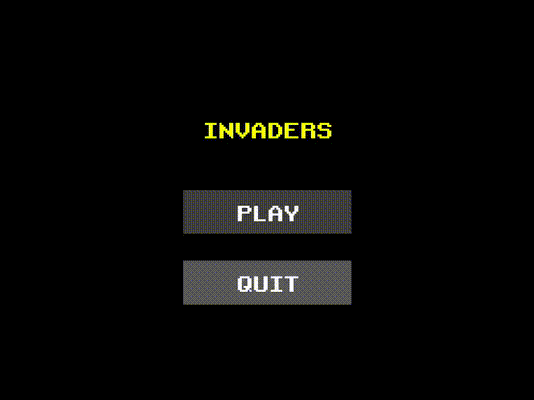

# Invaders

A Space Invaders-like game written with the Bevy engine.

## Licenses

### Code

The code in this repository is licensed under the [MIT License](LICENSE).

### Images

The [window icon](assets/icon.png) is a modified variant
of [this one](https://www.hiclipart.com/free-transparent-background-png-clipart-qqtdq) and is available for
non-commercial purposes.

### Music

"Retro Arcade" by Beat Mekanik is licensed under
an [Attribution 4.0 International License](https://creativecommons.org/licenses/by/4.0/). You can find
it [here](https://freemusicarchive.org/music/beat-mekanik/single/retro-arcade).

### Sounds

Some sound effects come from [this page](https://www.classicgaming.cc/classics/space-invaders/sounds) where no license
was specified. The other [sounds](https://gamesounds.xyz/?dir=Sound%20Effects) in this repository have full rights and
can be freely used without restrictions.

### Font

The [font](https://www.dafont.com/retro-gaming.font) included in this repository is available for free use, but no
specific license information was found.
